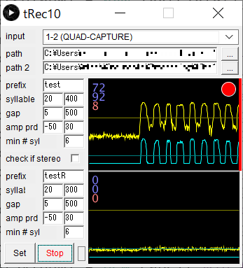

# tRec (triggered recorder)
- "tRed" detects birdsongs and records them into audio files (WAV).  
- This software has been developed for recording finches's songs that are placed in isolated recording chambers.  
- To save computer storage, tRec records only singing periods by detecting sucessive sound elements (such as "pi pi pi pi ..."). 
- Originally it has been developed with Processing/Java programming language.

### Recording spec
- 32 kHz sampling, 16 bit resolution
- PCM waveform (WAV) files
- Either stereo and monaural recording

### Song detection
1) Thresholding: tRec monitors two sound features: sound volume (or "amplitude envelope") and tonality (or "periodicity") of audio inputs, and dectects as song syllables when the input exceeds predefined thresholds for them. The periodicity ranges between 0 and 100, and becomes low (<20) for noises (jumping and flapping sounds), but high (>50) for vocal calls and song syllables.  
2) Syllable and gap durations: (to be filled...)
3) Count syllables: (to be filled...)
4) Detect song onset: (to be filled...)
5) Song offset: (to be filled...)

### User guide
(still writing...)
- selecte audio input
- switching stereo and monoural mode
- set folder path to save audio files
- filename prefix
- set duration ranges of syllable and gap
- set thresholds for 

### Additional information
#### Signal processing in tRec
(still writing...)
- analysis window size: 256 samples (8 ms) / time step: 64 samples (2 ms)
- band-pass filtering (1000-8000)
- amplitude envelope calculation
- periodicity calculation: YIN

